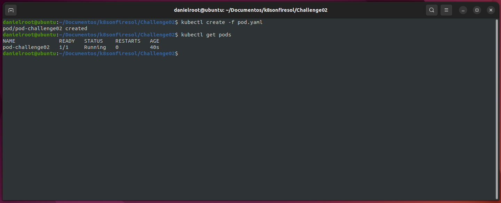
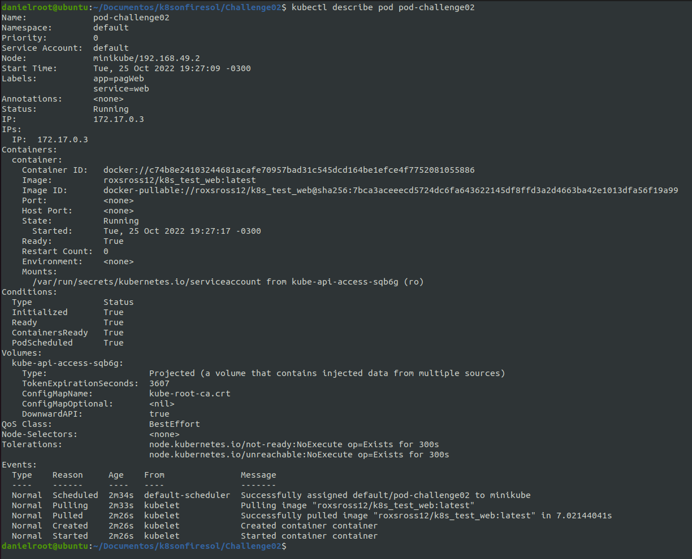
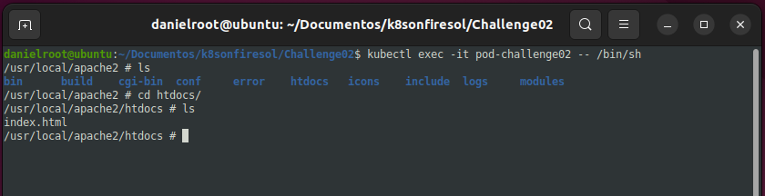
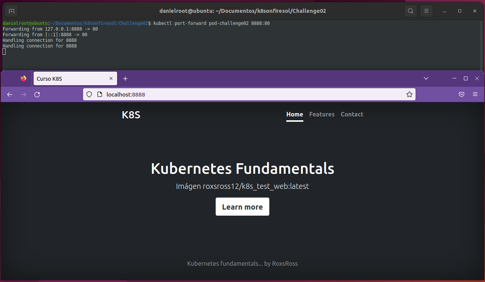
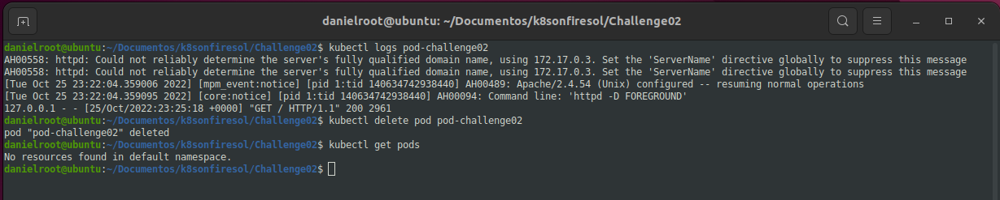

# 🔥 Challenge 02 🔥 

## 1 - Archivo de definición del Pod.

[pod.yaml](./pod.yaml)

## 2 - Creación del Pod.

## 3 - Imfomación detallada del Pod.

## 4 - Fichero `index.html` del DocumentRoot.

## 5 - Acceso al `port-forward` desde el navegador.

## 6 - Logs de acceso al Pod.

[Inicio](../README.md)